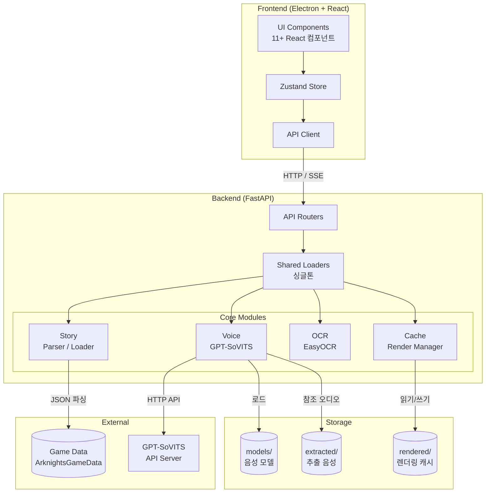
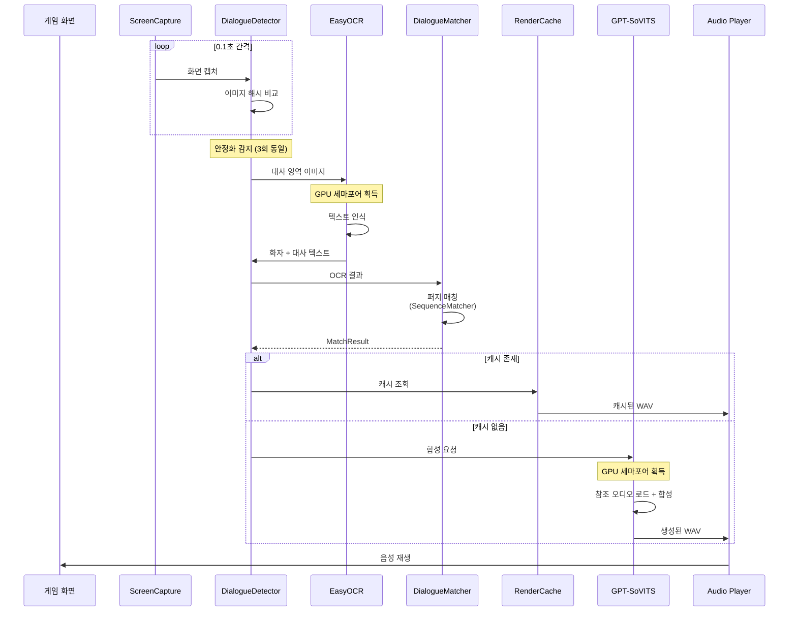
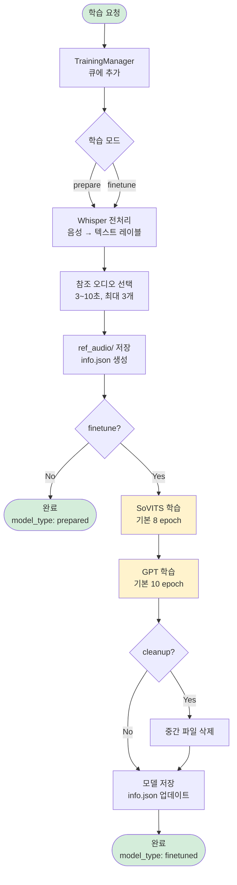
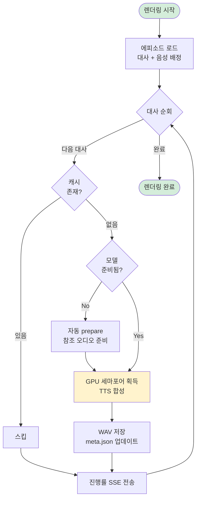
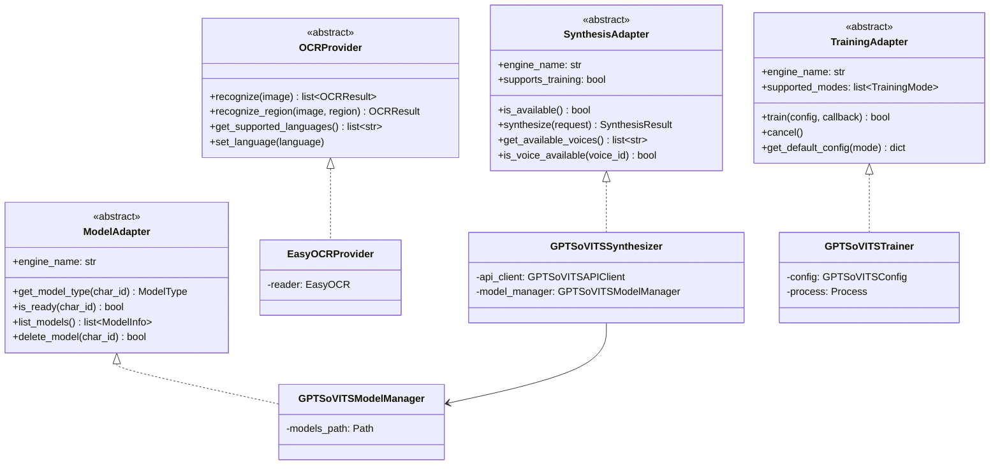

# ArkSynth 아키텍처

## 시스템 아키텍처



## API 라우터 구조

| 라우터 | 접두사 | 주요 기능 |
|--------|--------|-----------|
| health | `/` | 서버 상태, 버전, 언어 |
| episodes | `/api/episodes` | 에피소드 목록/상세/대사/캐릭터 |
| stories | `/api/stories` | 카테고리/그룹별 스토리 탐색 |
| tts | `/api/tts` | 음성 합성, 엔진 상태, 파라미터 |
| voice | `/api/voice` | 캐릭터 음성/이미지/매핑/성별/통계 |
| ocr | `/api/ocr` | 캡처/감지/매칭/영역설정/SSE 스트림 |
| render | `/api/render` | 사전 렌더링 시작/캐시/SSE 스트림 |
| training | `/api/training` | 학습 시작/모델관리/SSE 스트림 |
| settings | `/api/settings` | 언어/의존성/설치/추출/GPU |
| aliases | `/api/aliases` | 캐릭터 별칭 관리/제안 |
| data | `/api/data` | 게임 데이터 업데이트 (GitHub/PRTS) |
| update | `/api/update` | 앱 업데이트 확인 |

## 핵심 파이프라인

### 실시간 더빙



### 학습 파이프라인



### 렌더링 파이프라인



## 인터페이스 설계



### 인터페이스 파일 위치

| 인터페이스 | 파일 | 구현체 |
|-----------|------|--------|
| `OCRProvider` | `src/core/interfaces/ocr.py` | `EasyOCRProvider` |
| `SynthesisAdapter` | `src/core/voice/interfaces/synthesis_adapter.py` | `GPTSoVITSSynthesizer` |
| `TrainingAdapter` | `src/core/voice/interfaces/training_adapter.py` | `GPTSoVITSTrainer` |
| `ModelAdapter` | `src/core/voice/interfaces/model_adapter.py` | `GPTSoVITSModelManager` |

### 주요 데이터 모델

| 모델 | 파일 | 용도 |
|------|------|------|
| `Episode`, `Dialogue`, `Character` | `src/core/models/story.py` | 스토리 데이터 |
| `StoryGroup`, `StoryCategory` | `src/core/models/story.py` | 스토리 분류 |
| `MatchResult`, `MatchConfidence` | `src/core/models/match.py` | OCR 매칭 결과 |
| `SynthesisRequest/Result` | `src/core/voice/interfaces/synthesis_adapter.py` | TTS 요청/응답 |
| `TrainingConfig/Progress` | `src/core/voice/interfaces/training_adapter.py` | 학습 설정/진행 |
| `ModelInfo`, `ModelType` | `src/core/voice/interfaces/model_adapter.py` | 모델 상태 |

## GPU 리소스 관리

OCR(EasyOCR)과 TTS(GPT-SoVITS)가 동시에 GPU를 사용하면 VRAM 부족으로 크래시가 발생한다.
이를 방지하기 위해 전역 `asyncio.Semaphore(1)`로 GPU 접근을 직렬화한다.

```text
backend/__init__.py
  └── _gpu_semaphore = asyncio.Semaphore(1)
      ├── OCR 인식 시 획득 (easyocr_provider.py)
      ├── TTS 합성 시 획득 (synthesizer.py)
      └── gpu_semaphore_context() 컨텍스트 매니저
```

예상 VRAM 사용량:

- EasyOCR: ~1-2GB
- GPT-SoVITS: ~2-4GB
- 권장: NVIDIA GPU 6GB VRAM 이상

## SSE 스트리밍

장시간 작업은 Server-Sent Events로 실시간 진행률을 전송한다.

| 스트림 | 엔드포인트 | 이벤트 |
|--------|-----------|--------|
| OCR 실시간 감지 | `GET /api/ocr/stream` | 대사 감지, 매칭 결과 |
| 렌더링 진행률 | `GET /api/render/stream` | 진행률, 완료/에러 |
| 학습 진행률 | `GET /api/training/stream` | 단계, epoch, 완료/에러 |
| 설치 진행률 | `GET /api/settings/install/stream` | 다운로드/압축해제 진행률 |

## 명명 규칙

| 영역 | 규칙 | 예시 |
|------|------|------|
| Python 함수/변수 | snake_case | `load_episode`, `char_id` |
| Python 클래스 | PascalCase | `StoryLoader`, `GPTSoVITSSynthesizer` |
| TypeScript 함수/변수 | camelCase | `fetchEpisode`, `charId` |
| React 컴포넌트 | PascalCase | `DialogueViewer`, `VoiceSetupPanel` |
| API URL | kebab-case | `/api/voice/characters` |
| JSON 필드 | snake_case | `episode_id`, `speaker_name` |
